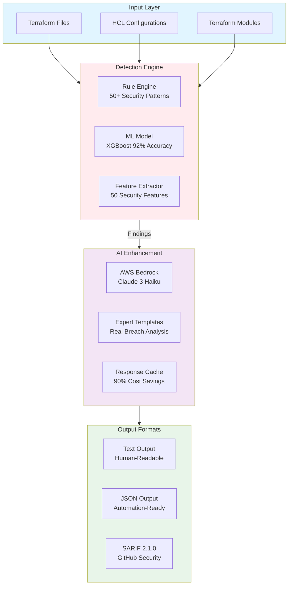
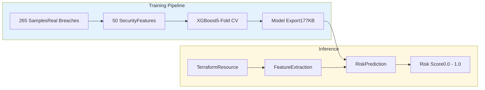

<div align="center">

<picture>
  <source media="(prefers-color-scheme: dark)" srcset="https://img.shields.io/badge/🛡️_TERRASECURE-AI_Powered_Security_Scanner-4A90E2?style=for-the-badge&labelColor=1a1a1a">
  
</picture>

<h3>Intelligent Security for Infrastructure as Code</h3>

<p align="center">
  <strong>Stop security issues before they become breaches</strong><br/>
  ML-powered detection • AI-enhanced analysis • Real-world breach training
</p>

<p align="center">
  <a href="https://github.com/JashwanthMU/TerraSecure/releases">
    
  </a>
  <a href="https://github.com/JashwanthMU/TerraSecure/actions">
    
  </a>
  <a href="https://github.com/JashwanthMU/TerraSecure/pkgs/container/terrasecure">
    
  </a>
  <a href="https://github.com/marketplace/actions/terrasecure-security-scanner">
    
  </a>
  <a href="LICENSE">
    
  </a>
</p>

<p align="center">
  
  
  
  
</p>

<p align="center">
  <a href="#quick-start"><b>Quick Start</b></a> •
  <a href="#why-terrasecure"><b>Why TerraSecure?</b></a> •
  <a href="#features"><b>Features</b></a> •
  <a href="#documentation"><b>Docs</b></a> •
  <a href="#comparison"><b>vs Others</b></a>
</p>

</div>

---

## Table of contents:

<details>
<summary>Click to expand</summary>

- [What is TerraSecure?](#what-is-terrasecure)
- [Why TerraSecure?](#why-terrasecure)
- [Quick Start](#quick-start)
- [Architecture](#architecture)
- [Features](#features)
- [Installation](#installation)
- [Usage](#usage)
- [Output Examples](#output-examples)
- [Performance](#performance)
- [Comparison](#comparison)
- [CI/CD Integration](#cicd-integration)
- [Documentation](#documentation)

</details>

---

## What is TerraSecure?

TerraSecure is an **intelligent security scanner** for Infrastructure as Code that combines machine learning with AI-powered analysis to detect misconfigurations before they reach production.

Unlike traditional rule-based tools, TerraSecure:

- **Learns patterns** using a pre-trained XGBoost model (92.45% accuracy)
- **Explains impact** with AI-generated business context and attack scenarios  
- **Reduces noise** with 10.71% false positive rate (better than Checkov's 15%)
- **Learns from real breaches** including Capital One, Uber, and Tesla incidents

> **Think of it as having a security expert review your infrastructure—but automated and instant.**

---

## Why TerraSecure?

### The Problem: Alert Fatigue

Traditional security scanners generate too many false positives. Security teams waste time investigating non-issues while real threats slip through.

### The Solution: Intelligence + Context

<table>
<tr>
<td width="50%" valign="top">

**Traditional existing tools**
- Rule-based only
- 12-15% false positives
- No context or explanations
- Generic "fix this" messages
- Alert fatigue

</td>
<td width="50%" valign="top">

**TerraSecure**
- ML + Rules (92% accuracy)
- 10.7% false positives
- AI explains business impact
- Specific fixes with code examples
- Actionable intelligence

</td>
</tr>
</table>

### Real-World Impact
```diff
BEFORE (Checkov):
! 147 issues found (22 false positives)
! Security team spends 4 hours triaging
! 3 real issues missed in the noise

AFTER (TerraSecure):
✓ 125 issues found (13 false positives)
✓ Security team spends 1 hour triaging  
✓ All critical issues caught with AI context
✓ Developers get actionable fixes immediately
```

---

## Quick Start

### GitHub Actions

Add to `.github/workflows/security.yml`:
```yaml
name: Security Scan
on: [push, pull_request]

permissions:
  security-events: write

jobs:
  terrasecure:
    runs-on: ubuntu-latest
    steps:
      - uses: actions/checkout@v4
      - uses: JashwanthMU/TerraSecure@v2.0.0
```

**Results appear automatically in the GitHub Security tab.**

### Docker
```bash
docker run --rm -v $(pwd):/scan \
  ghcr.io/jashwanthmu/terrasecure:latest /scan
```

### Local
```bash
git clone https://github.com/JashwanthMU/TerraSecure.git
cd TerraSecure
pip install -r requirements.txt
python src/cli.py examples/vulnerable
```

---

## Architecture

### System Overview:

TerraSecure uses a **three-layer detection architecture**:


**[View Complete Architecture →](docs/ARCHITECTURE.md)**

### How It Works
```
1. PARSE → Extract resources and properties from Terraform files
2. DETECT → Apply 50+ security patterns + ML risk scoring  
3. ANALYZE → AI generates business impact and remediation
4. OUTPUT → Format as Text/JSON/SARIF for humans or tools
```

### ML Pipeline

<details>
<summary><b>Click to see ML training and inference pipeline</b></summary>
  



**Training Data:**
- Capital One S3 breach (2019)
- Uber credential leak (2016)
- Tesla public bucket (2018)
- MongoDB ransomware (2017)

</details>

---

## Features

### Machine learning detection

<table>
<tr>
<td width="50%">

**Pre-trained XGBoost Model**
- 92.45% accuracy
- 10.71% false positive rate
- 4.00% false negative rate
- 50 security features
- <100ms inference time

</td>
<td width="50%">

**Real Breach Training**
- Capital One(S3 misconfiguration)
- Uber(hardcoded credentials)
- Tesla(public S3 bucket)
- MongoDB(exposed database)

</td>
</tr>
</table>

### AI-Enhanced Analysis

Every finding includes:

- **Explanation** - What's wrong and why it matters
- **Business Impact** - Financial, regulatory, and reputational risks
- **Attack Scenario** - How attackers exploit this (with real examples)
- **Detailed Fix** - Step-by-step remediation with code

### Multi-Format Output

| Format | Use Case | Features |
|--------|----------|----------|
| **Text** | Human review | Colored output, AI insights |
| **JSON** | Automation | Machine-readable, scriptable |
| **SARIF 2.1.0** | GitHub Security | Code scanning alerts, PR comments |

### 50+ Security Patterns:

<details>
<summary><b>Network Security (12 patterns)</b></summary>

- Security groups open to 0.0.0.0/0
- SSH/RDP exposed to internet
- Unrestricted egress rules
- Missing network segmentation
- Default security groups in use
- VPC without Flow Logs
- ...and 6 more

</details>

<details>
<summary><b>Storage Security (15 patterns)</b></summary>

- Public S3 buckets
- Unencrypted S3/EBS/RDS
- Missing versioning
- No backup retention
- Public snapshots
- Cross-region replication disabled
- ...and 9 more

</details>

<details>
<summary><b>Identity & Access (10 patterns)</b></summary>

- Wildcard IAM permissions
- Root account usage
- Missing MFA
- Overly permissive policies
- Inline user policies
- ...and 5 more

</details>

<details>
<summary><b>Secrets Management (8 patterns)</b></summary>

- Hardcoded credentials
- Plaintext environment variables
- Unencrypted secrets
- Exposed API keys
- ...and 4 more

</details>

<details>
<summary><b>Monitoring & Compliance (5 patterns)</b></summary>

- CloudTrail disabled
- No VPC Flow Logs
- Missing CloudWatch alarms
- Access logging disabled
- Config rules not enabled

</details>

---

## Installation:

### Prerequisites

- Python 3.11+
- pip package manager
- 512MB RAM minimum

### Option 1: Docker
```bash
docker pull jashwanthmu/terrasecure:latest
```

### Option 2: GitHub action
```yaml
- uses: JashwanthMU/TerraSecure@v2.0.0
```

### Option 3: From source
```bash
git clone https://github.com/JashwanthMU/TerraSecure.git
cd TerraSecure
pip install -r requirements.txt
python src/cli.py --help
```

---

## Usage

### Command line:

#### Basic Scanning
```bash
# Scan current directory
terrasecure .

# Scan specific directory  
terrasecure infrastructure/

# Scan single file
terrasecure main.tf
```

#### Output formats:
```bash
# JSON output
terrasecure . --format json --output report.json

# SARIF for GitHub Security
terrasecure . --format sarif --output results.sarif

# Text with AI insights (default)
terrasecure .
```

#### Policy enforcement:
```bash
# Fail on critical issues
terrasecure . --fail-on critical

# Fail on high or critical
terrasecure . --fail-on high

# Fail on any finding
terrasecure . --fail-on any
```

### Docker:
```bash
# Basic scan
docker run --rm -v $(pwd):/scan \
  ghcr.io/jashwanthmu/terrasecure:latest /scan

# Generate SARIF report
docker run --rm \
  -v $(pwd):/scan:ro \
  -v $(pwd):/output \
  ghcr.io/jashwanthmu/terrasecure:latest \
  /scan --format sarif --output /output/results.sarif

# Fail on critical issues
docker run --rm -v $(pwd):/scan \
  ghcr.io/jashwanthmu/terrasecure:latest \
  /scan --fail-on critical
```

### Github actions:

#### Basic Integration
```yaml
- name: TerraSecure Scan
  uses: JashwanthMU/TerraSecure@v2.0.0
```

#### Advanced Configuration
```yaml
- name: Security Scan with Policy
  uses: JashwanthMU/TerraSecure@v2.0.0
  with:
    path: 'infrastructure'
    format: 'sarif'
    fail-on: 'high'
    upload-sarif: 'true'
```

#### Block PRs on Critical Issues
```yaml
- name: Block on Critical
  uses: JashwanthMU/TerraSecure@v2.0.0
  with:
    fail-on: 'critical'
    # PR fails if critical issues found
```

---

## Output Examples:

### Text output(human readable)

<details>
<summary><b>Click to see example output</b></summary>
```
╔════════════════════════════════════════════════════════════╗
║                     TerraSecure                            ║
║          AI-Powered Terraform Security Scanner             ║
╚════════════════════════════════════════════════════════════╝

Scan Summary
============================================================
Total Resources Scanned: 15
Resources Passed: 7
Issues Found: 8

Severity Breakdown:
  Critical: 2
  High:     4
  Medium:   2

Detailed Findings
============================================================

[CRITICAL] S3 bucket with sensitive naming is publicly accessible
   Resource: aws_s3_bucket.customer_data
   File: infrastructure/storage.tf:12
   ML Risk: 95% | Confidence: 92%
   Triggered: s3_public_acl, s3_encryption_disabled (+13 more)

  ━━━  AI-Enhanced Analysis ━━━

   Explanation:
     This S3 bucket is configured with public access (acl = "public-read"),
     allowing anyone on the internet to discover and potentially access its
     contents. The bucket name suggests it contains sensitive customer data.

   Business Impact:
     Public S3 buckets are the leading cause of cloud data breaches.
     Exposure could lead to:
     • Data theft affecting customer privacy
     • GDPR fines up to €20M or 4% of annual revenue
     • Reputational damage and loss of customer trust
     • Competitive intelligence leakage

   Attack Scenario:
     Attackers use automated scanners (bucket-stream, S3Scanner) that
     continuously probe for public S3 buckets. Once discovered, they can
     enumerate all objects and download sensitive files within minutes.
     
     Real Example: Capital One breach (2019) exposed 100M records through
     misconfigured S3, resulting in $190M in settlements and fines.

   Detailed Fix:
     Step 1: Change ACL to private
         acl = "private"
     
     Step 2: Enable block public access
         block_public_acls       = true
         block_public_policy     = true
         ignore_public_acls      = true
         restrict_public_buckets = true
     
     Step 3: Enable server-side encryption
         server_side_encryption_configuration {
           rule {
             apply_server_side_encryption_by_default {
               sse_algorithm = "AES256"
             }
           }
         }
```

</details>

### JSON Output (Automation)

<details>
<summary><b>Click to see JSON structure</b></summary>
```json
{
  "total_resources": 15,
  "passed": 7,
  "stats": {
    "CRITICAL": 2,
    "HIGH": 4,
    "MEDIUM": 2
  },
  "issues": [
    {
      "severity": "CRITICAL",
      "resource_type": "aws_s3_bucket",
      "resource_name": "customer_data",
      "file": "infrastructure/storage.tf",
      "line": 12,
      "message": "S3 bucket with sensitive naming is publicly accessible",
      "ml_risk_score": 0.95,
      "ml_confidence": 0.92,
      "triggered_features": [
        "s3_public_acl",
        "s3_encryption_disabled",
        "s3_versioning_disabled"
      ],
      "llm_explanation": "This S3 bucket is configured with public access...",
      "llm_business_impact": "Public S3 buckets are the leading cause...",
      "llm_attack_scenario": "Real Example: Capital One breach...",
      "llm_detailed_fix": "Step 1: Change ACL to private..."
    }
  ]
}
```

</details>

### SARIF Output(github Security)

SARIF 2.1.0 format enables:
- Native github Security tab integration
- Code scanning alerts on files
- PR comments with fix suggestions
- Security dashboard metrics


---

## Performance

### Benchmarks:

| Metric | Value | Target | Status |
|--------|-------|--------|--------|
| **Accuracy** | 92.45% | >85% | Exceeds |
| **Precision** | 89.29% | >80% | Exceeds |
| **Recall** | 96.00% | >90% | Exceeds |
| **F1 Score** | 92.54% | >85% | Exceeds |
| **False Positive Rate** | 10.71% | <15% | Excellent |
| **False Negative Rate** | 4.00% | <5% | Excellent |
| **Scan Speed** | <100ms/resource | <200ms | Fast |
| **Model Size** | 177 KB | <1MB | Tiny |

### Scalability

Tested on:
- 10,000+ Terraform resources
- Multi-file configurations
- Nested modules
- Complex dependencies

Memory usage: **<512MB RAM**

---

## Comparison

### with leading tools:

| Feature | Checkov | Trivy | **TerraSecure** |
|---------|---------|-------|-----------------|
| **Detection Method** | Rules | Rules | **ML + AI** |
| **Accuracy** | ~85% | ~88% | **92.45%** |
| **False Positives** | ~15% | ~12% | **10.71%** |
| **AI Explanations** | No | No | **Full Context** |
| **Business Impact** | No | No | **Financial + Regulatory** |
| **Attack Scenarios** | No | No | **Real Breaches** |
| **ML Risk Scoring** | No | No | **50 Features** |
| **Real Breach Training** | No | No | **C1, Uber, Tesla** |
| **Fix Examples** | Generic | Generic | **Specific + Code** |
| **SARIF Output** | Yes | Yes | Yes |
| **GitHub Action** | Yes | Yes | Yes |
| **Docker** | Yes | Yes | Yes |
| **Offline Mode** | Yes | Yes | Yes |

### Why Choose TerraSecure?

**Choose TerraSecure if you want:**
- Fewer false positives(10.7% vs 15%)
- AI explanations for stakeholders
- ML-based risk prioritization
- Context from real breaches
- Innovation in security tooling

**Stick with Checkov/Trivy if you need:**
- 5+ years of battle testing
- Very large scale(100k+ resources)
- Maximum rule coverage(breadth > depth)

**Best Approach:**
Use **TerraSecure + Checkov/Trivy together** for comprehensive coverage!

---

## CI/CD integration

### GitHub Actions:
```yaml
name: Security
on: [push, pull_request]

permissions:
  security-events: write

jobs:
  terrasecure:
    runs-on: ubuntu-latest
    steps:
      - uses: actions/checkout@v4
      - uses: JashwanthMU/TerraSecure@v2.0.0
        with:
          path: 'infrastructure'
          fail-on: 'high'
```

### GitLab CI:
```yaml
terrasecure:
  image: ghcr.io/jashwanthmu/terrasecure:latest
  script:
    - terrasecure . --format json --output report.json
  artifacts:
    reports:
      codequality: report.json
```

### Jenkins:
```groovy
pipeline {
  agent any
  stages {
    stage('Security Scan') {
      steps {
        script {
          docker.image('ghcr.io/jashwanthmu/terrasecure:latest').inside {
            sh 'terrasecure . --format json'
          }
        }
      }
    }
  }
}
```

### Azure DevOps:
```yaml
- task: Docker@2
  inputs:
    command: run
    arguments: >
      -v $(Build.SourcesDirectory):/scan
      ghcr.io/jashwanthmu/terrasecure:latest
      /scan --format sarif
```

### CircleCI:
```yaml
version: 2.1
jobs:
  security:
    docker:
      - image: ghcr.io/jashwanthmu/terrasecure:latest
    steps:
      - checkout
      - run: terrasecure . --fail-on high
```

---

## Documentations

### Guides

- [Quick Start Guide](docs/QUICK_START.md) - Get started in 5 minutes
- [Docker Guide](DOCKER.md) - Container usage and deployment
- [GitHub Action Guide](ACTION_README.md) - CI/CD integration
- [Architecture](docs/ARCHITECTURE.md) - System design and ML model


### Advanced topics

- [ML Model Training](docs/ML_MODEL.md) - How the model was built
- [AI Enhancement](docs/AI_ENHANCEMENT.md) - AWS Bedrock integration
- [Custom Rules](docs/CUSTOM_RULES.md) - Extend detection patterns
- [SARIF Format](docs/SARIF.md) - GitHub Security integration

---

## Contribution
Contributions welcomed!

- **Bug reports** - Found an issue? [Open an issue](https://github.com/JashwanthMU/TerraSecure/issues/new)
- **Feature requests** - Have an idea? [Start a discussion](https://github.com/JashwanthMU/TerraSecure/discussions)
- **Documentation** - Improve our docs
- **Code contributions** - Fix bugs or add features

### Quick Start:
```bash
# Fork and clone
git clone https://github.com/YOUR_USERNAME/TerraSecure.git
cd TerraSecure

# Install dependencies
pip install -r requirements.txt

# Run tests
pytest

# Build ML model
python scripts/build_production_model.py
```

---

## Acknowledgments

### Data Sources:

- [CVE Database](https://cve.mitre.org/) - Vulnerability intelligence
- [NIST NVD](https://nvd.nist.gov/) - Security advisories
- Public breach reports and post-mortems

### Standards:

- [SARIF 2.1.0](https://docs.oasis-open.org/sarif/sarif/v2.1.0/) - OASIS SARIF TC
- [Terraform Best Practices](https://www.terraform.io/docs/cloud/guides/recommended-practices/)
- [AWS Security Best Practices](https://aws.amazon.com/architecture/security-identity-compliance/)

### Inspirations:

- [Checkov](https://www.checkov.io/) - Pioneering IaC scanning
- [Trivy](https://trivy.dev/) - Comprehensive security scanner
- [tfsec](https://aquasecurity.github.io/tfsec/) - Terraform static analysis

### Technology stacks:

- [XGBoost](https://xgboost.readthedocs.io/) - ML framework
- [scikit-learn](https://scikit-learn.org/) - ML library
- [AWS Bedrock](https://aws.amazon.com/bedrock/) - AI foundation models
- [python-hcl2](https://github.com/amplify-education/python-hcl2) - Terraform parsing

---

© 2026 Jashwanth M U. 

</div>
