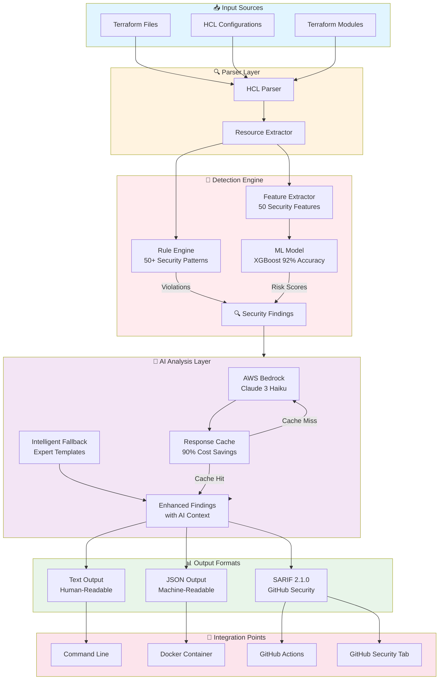
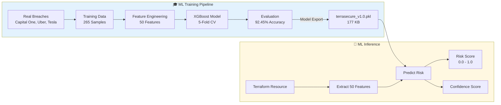
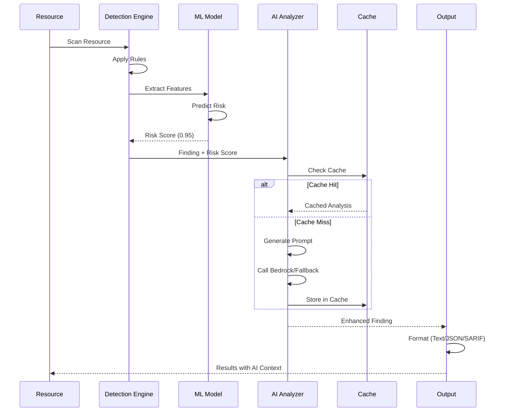
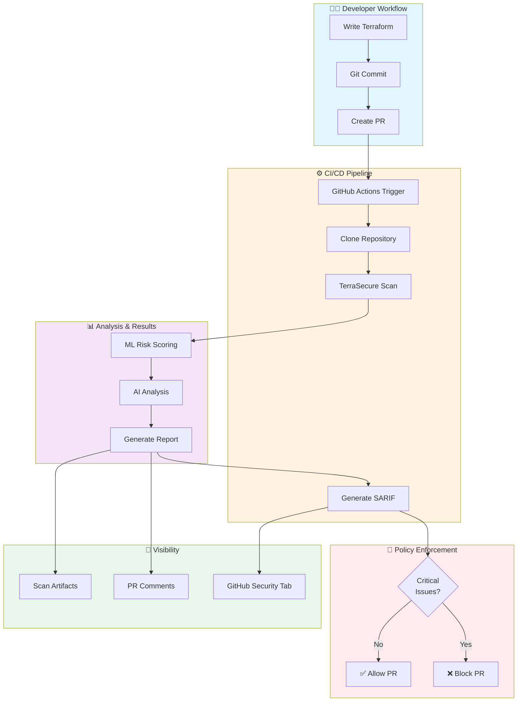

# TerraSecure Architecture

Complete technical architecture and design documentation.

## Table of Contents

- [Overview](#overview)
- [System Architecture](#system-architecture)
- [ML Pipeline](#ml-pipeline)
- [AI Enhancement](#ai-enhancement)
- [CI/CD Integration](#cicd-integration)
- [Data Flow](#data-flow)
- [Components](#components)

---

## Overview

TerraSecure is a **ML-powered security scanner** for Infrastructure as Code that combines:

1. **Rule-based detection** (50+ security patterns)
2. **Machine learning** (XGBoost model, 92% accuracy)
3. **AI analysis** (AWS Bedrock + intelligent fallback)
4. **Multi-format output** (Text, JSON, SARIF 2.1.0)

---

## System Architecture

### High-Level Architecture


---

## ML Pipeline

### Training Pipeline


### 50 Security Features

| Category | Features | Example |
|----------|----------|---------|
| **Network** | 12 features | `open_cidr_0_0_0_0`, `open_ssh_port_22` |
| **Storage** | 15 features | `s3_public_acl`, `s3_encryption_disabled` |
| **IAM** | 10 features | `iam_wildcard_policy`, `root_account_usage` |
| **Secrets** | 8 features | `hardcoded_credentials`, `plaintext_secrets` |
| **Monitoring** | 5 features | `cloudtrail_disabled`, `no_vpc_flow_logs` |

---

## AI Enhancement

### AI Analysis Flow


### AI Enhancement Components

**AWS Bedrock Mode:**
- Model: Claude 3 Haiku
- Cost: ~$0.25/M input tokens
- With caching: ~$2-5/month for 1000 scans
- Response time: ~500ms per finding

**Fallback Mode:**
- Expert templates from real breaches
- Cost: $0 (completely free)
- Response time: <1ms per finding
- Quality: Expert-level analysis

---

## CI/CD Integration

### GitHub Actions Flow


---

## Data Flow

### End-to-End Scan Flow

1. **Input** - Terraform files parsed with python-hcl2
2. **Extraction** - Resources and properties extracted
3. **Rule Detection** - 50+ security patterns applied
4. **Feature Extraction** - 50 ML features computed
5. **ML Prediction** - XGBoost model predicts risk (0.0-1.0)
6. **AI Enhancement** - Bedrock/fallback adds context
7. **Output** - Formatted as Text/JSON/SARIF
8. **Integration** - Uploaded to GitHub Security / CI/CD

### Example: S3 Bucket Scan
```
S3 Bucket (public-read ACL)
    ↓
Parser extracts properties
    ↓
Rule Engine detects: public_s3_with_sensitive_data
    ↓
Feature Extractor computes 50 features:
  - s3_public_acl: 1
  - s3_encryption_disabled: 1
  - s3_versioning_disabled: 1
  - ... (47 more)
    ↓
ML Model predicts:
  - Risk Score: 0.95 (95% risky)
  - Confidence: 0.92 (92% confident)
    ↓
AI Analyzer enhances:
  - Explanation: "Public S3 allows unauthorized access..."
  - Business Impact: "GDPR fines up to €20M..."
  - Attack Scenario: "Capital One breach (2019)..."
  - Fix: "Step 1: Set acl = 'private'..."
    ↓
Output (SARIF/JSON/Text)
    ↓
GitHub Security Tab shows finding
```

---

## Components

### Core Components

| Component | Technology | Purpose |
|-----------|------------|---------|
| **Parser** | python-hcl2 | Parse Terraform files |
| **Rule Engine** | Python | Apply 50+ security patterns |
| **Feature Extractor** | NumPy, Pandas | Compute 50 ML features |
| **ML Model** | XGBoost | Predict risk scores |
| **AI Analyzer** | AWS Bedrock (Claude 3) | Generate explanations |
| **SARIF Formatter** | Python | GitHub Security integration |
| **CLI** | Click | Command-line interface |

### File Structure
```
TerraSecure/
├── src/
│   ├── cli.py                 # Command-line interface
│   ├── scanner/
│   │   ├── parser.py          # Terraform parser
│   │   └── analyzer.py        # Main orchestrator
│   ├── rules/
│   │   └── security_rules.py  # 50+ security patterns
│   ├── ml/
│   │   ├── ml_analyzer.py     # ML inference
│   │   └── feature_extractor.py # Feature engineering
│   ├── llm/
│   │   └── bedrock_analyzer.py # AI enhancement
│   └── formatters/
│       └── sarif_formatter.py  # SARIF output
├── models/
│   └── terrasecure_production_v1.0.pkl # Pre-trained model
├── scripts/
│   └── build_production_model.py # Model training
└── tests/
    ├── unit/           # Unit tests
    └── integration/    # Integration tests
```

---

## Performance Characteristics

### Scalability

| Metric | Value |
|--------|-------|
| **Resources/sec** | ~100-200 |
| **Memory Usage** | < 512 MB |
| **Model Load Time** | < 1 second |
| **Scan Time (100 resources)** | ~5-10 seconds |
| **Scan Time (1000 resources)** | ~50-100 seconds |

### Accuracy Metrics

| Metric | Value | Benchmark |
|--------|-------|-----------|
| **Accuracy** | 92.45% | > 85% target |
| **Precision** | 89.29% | High |
| **Recall** | 96.00% | Excellent |
| **F1 Score** | 92.54% | Balanced |
| **False Positive Rate** | 10.71% | < 15% target |
| **False Negative Rate** | 4.00% | < 5% target |

---

## Security & Privacy

### Data Handling

-  **Offline by default** - No external API calls required
-  **Local ML inference** - Model runs on your machine
-  **Optional cloud** - Bedrock is opt-in only
-  **No telemetry** - No usage data collected
-  **Open source** - Full code transparency

### Secrets Handling

-  Never logs secrets
-  Never stores credentials
-  Never sends code to external services (without opt-in)
-  Detects hardcoded secrets
-  Warns about plaintext exposure

---

## Future Architecture (v2.1+)

### v2.1: Enhanced AI

- Real-time Bedrock streaming
- Response caching improvements
- Multi-model support (Haiku + Sonnet)

### v2.2: Compliance Engine

- NIST 800-53 mapping engine
- CIS Benchmark checker
- PCI-DSS validator

### v2.3: Multi-Cloud

- Azure ARM template support
- GCP Deployment Manager
- Kubernetes manifest scanning

---

## References

- [XGBoost Documentation](https://xgboost.readthedocs.io/)
- [AWS Bedrock](https://aws.amazon.com/bedrock/)
- [SARIF 2.1.0 Specification](https://docs.oasis-open.org/sarif/sarif/v2.1.0/)
- [Terraform Documentation](https://www.terraform.io/docs)

---

© 2026 TerraSecure - Built for DevSecOps Engineers